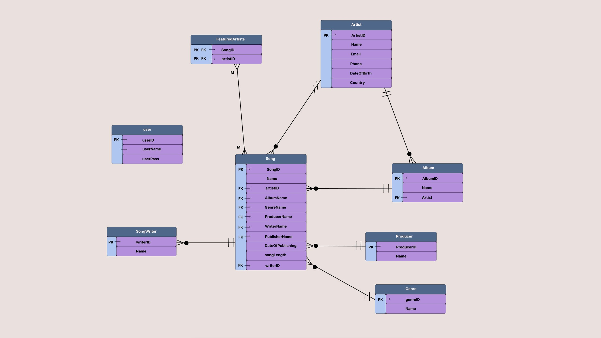

# DATABASE PROJECT #

# About #
 + Database project, music database
 + basic CRUD operations with my own database connectionpooling

# TABLES #

+ Song 
    + ID
    + Name
    + mainArtistName (FK)
    + AlbumName (FK)
    + GenreName (FK)
    + ProducerName (FK)
    + WriterName (FK)
    + PublisherName (FK)
    + DateOfPublishing
    + songLength

+ Artist
    + ID
    + Name
    + email
    + DoB 

+ Producer
    + ID
    + Name

+ Writer
    + ID
    + Name

+ Publisher
    + ID
    + Name

+ Genre
    + ID
    + Name

+ Album
    + ID
    + Name
    + Release
    + nSongs
    + Artist (FK)
    + Publisher (FK)

+ FEATUREDARTISTS
    + songID (FK)
    + artist (FK)

+ user
    + userID
    + userName
    + userPassWord

# ERD #

